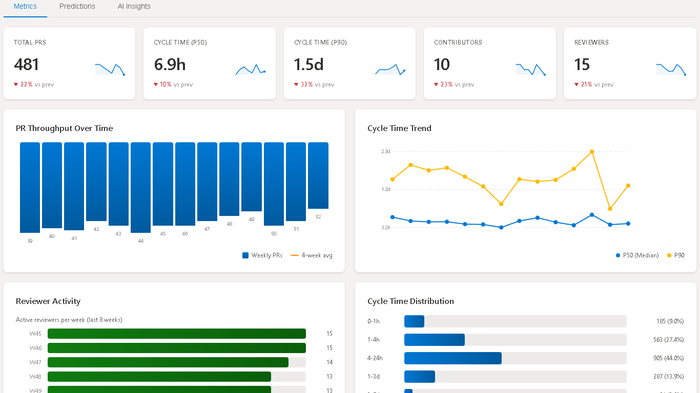
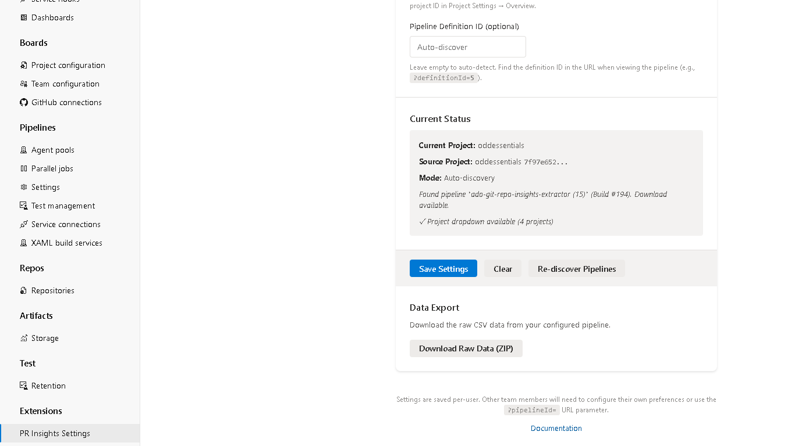
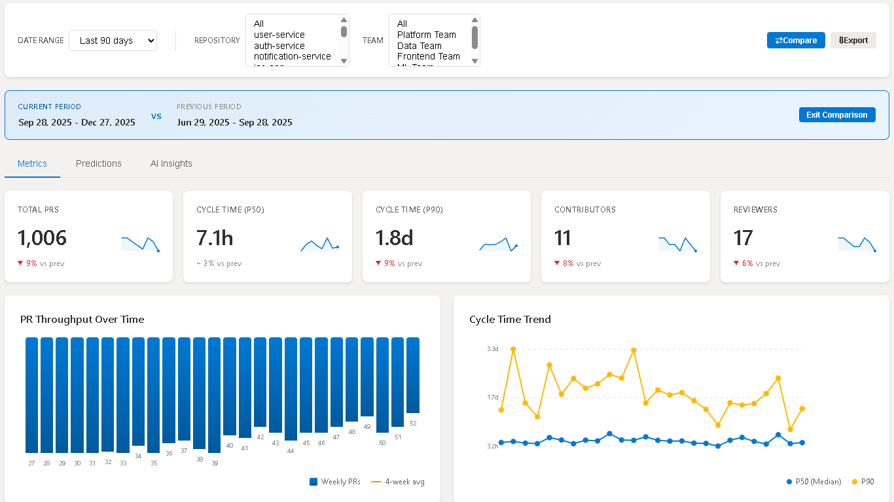
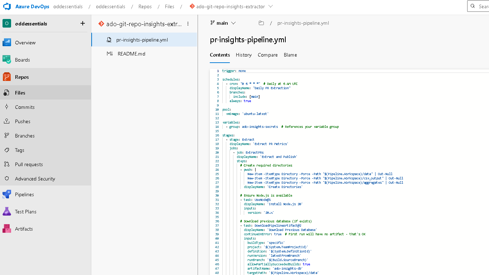

# Git Repo Insights

Pull request analytics for Azure DevOps — built-in dashboard with cycle time, throughput, and reviewer metrics.

Previously available via private share to select organizations; now in public preview.

## What You Get

### Core (works immediately after install)

- **PR Insights Dashboard** — Interactive dashboard embedded directly in your Azure DevOps project with cycle time trends, throughput charts, reviewer activity heatmaps, and distribution analysis
- **PR Insights Settings** — Project-level settings page for administrators to configure dashboard behavior, accessible from Project Settings
- **Automated PR Extraction** — Pipeline task extracts pull request data incrementally, minimizing API calls with smart date windowing and backfill convergence

### Optional Add-Ons (requires additional pipeline configuration)

- **ML Predictions** — Time-to-merge forecasting using Prophet models. Requires setting `enablePredictions: true` in the pipeline task and installing Python Prophet dependencies.
- **AI-Powered Insights** — Natural language summaries of PR trends and anomalies. Requires providing an OpenAI API key via pipeline variable.

## Dashboard

The PR Insights Dashboard shows: total PRs, cycle time (P50/P90), active contributors and reviewers, weekly throughput trend, reviewer activity, and cycle-time distribution buckets (<1 day, 1–3 days, 3–7 days, >7 days).

## Live Demo

Explore a working dashboard with sample data: [View Live Demo](https://oddessentials.github.io/ado-git-repo-insights/)

> **Important**: After installing, a project administrator must enable the dashboard via **Project Settings > Preview Features > [GRI] PR Insights Dashboard**. The dashboard is not visible until this feature flag is turned on.

## Getting Started

1. **Install** — Click "Get it free" to install Git Repo Insights in your Azure DevOps organization.
2. **Enable the Dashboard** — A project or organization administrator must go to **Project Settings > Preview Features** and turn on **[GRI] PR Insights Dashboard**.
3. **Create a PAT** — Generate a Personal Access Token with **Code (Read)** scope in Azure DevOps.
4. **Store the PAT** — Add the PAT to a pipeline Variable Group named `ado-insights-secrets` as a secret variable `PAT_SECRET`.
5. **Add the Pipeline Task** — Add `ExtractPullRequests@3` to a pipeline definition (see [Pipeline Task Reference](https://github.com/oddessentials/ado-git-repo-insights/blob/main/docs/reference/task-reference.md) for all inputs).
6. **View the Dashboard** — After a successful pipeline run, navigate to your project's Repos menu and select **PR Insights**.

## Requirements

- **Azure DevOps Services** (cloud) or **Azure DevOps Server 2020+** (on-premises)
- **Node.js 22+** on the build agent (use `UseNode@1` with `version: "22.x"`)
- **PAT** with **Code (Read)** scope
- Open source ([MIT License](https://github.com/oddessentials/ado-git-repo-insights/blob/main/LICENSE))

## Documentation

- [Pipeline Task Reference](https://github.com/oddessentials/ado-git-repo-insights/blob/main/docs/reference/task-reference.md) — All task inputs and modes
- [CSV Schema](https://github.com/oddessentials/ado-git-repo-insights/blob/main/docs/reference/csv-schema.md) — PowerBI output format
- [Full documentation](https://github.com/oddessentials/ado-git-repo-insights) on GitHub

## Support

[GitHub Issues](https://github.com/oddessentials/ado-git-repo-insights/issues)
